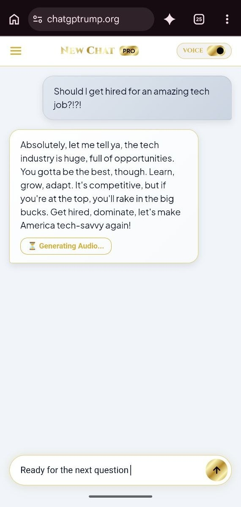
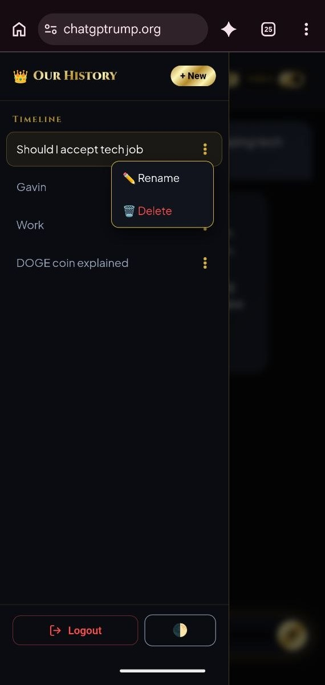

# Custom AI Voice Assistant & iOS Web App

A full-stack, local-LLM powered chatbot optimized as an iOS Web App, featuring streaming responses, persistent database sessions, and an asynchronous Text-to-Speech (TTS) pipeline.

This project integrates a locally hosted Qwen 2.5 14B model with a FastAPI backend and MySQL database, utilizing the Replicate API for advanced F5-TTS audio generation. It is built with a focus on security, concurrent processing, and mobile-first UI/UX.

## Interface Preview

| Light Mode | Dark Mode |
| :---: | :---: |
|  |  |

## Core Architecture & Features

* **Asynchronous TTS Pipeline:** Bypasses F5-TTS hardware and API limitations (30-second audio cap) by dynamically chunking LLM responses at 80 characters. The backend processes these API calls in parallel, downloads the audio locally to the server, and seamlessly chains the playback on the frontend without blocking the user interface.
* **Real-Time Streaming & Concurrency:** Chat responses stream in real-time. Because the TTS generation operates asynchronously, users can continue typing and interacting with the bot while previous audio is actively generating and downloading.
* **Smart Audio Playback State:** Maintains precise playback positioning. If a user pauses an active TTS stream, the application caches the state and seamlessly resumes from the exact timestamp without resetting the audio chain.
* **AI-Generated Session Titles:** Automatically generates context-aware chat titles by dynamically summarizing the initial user prompt, mimicking industry-standard LLM interfaces.
* **iOS Web App Optimization:** Fully styled for iOS mobile browsers with a custom logo, dark/light mode toggles, and intuitive chat management (rename, delete, full history access).
* **Secure & Cost-Optimized Authentication:** Designed for private use to control API costs. Features a strict, invite-only login portal managed via hashed passwords and persistent session tokens stored in the MySQL database.
* **External Integration & Control:** Integrates DuckDuckGo for live web search capabilities and includes a secure "override phrase" to instantly disable the custom persona instructions.
* **Hardened Deployment Environment:** Hosted via Uvicorn and routed securely through a Cloudflare domain. The server operates under a restricted Windows PowerShell user to minimize privileges and protect system architecture.

## Database Schema

The backend utilizes a relational MySQL database (`ai_chat_db`) to manage user sessions and chat history seamlessly.

* **`users`:** Manages authentication and session persistence, storing the `id`, `username`, `password_hash`, and a `session_token`. It also includes a `must_change_password` boolean flag for initial account setup.
* **`conversations`:** Tracks individual chat sessions, storing the `id`, `user_id`, and `title`. It utilizes `created_at` and `updated_at` timestamps for sorting chat history.
* **`messages`:** Links directly to conversations via a foreign key constraint and stores the `id`, `conversation_id`, `role`, and `content`. It caches the dynamically generated TTS links using `audio_url` and `audio_url_2` so the application does not need to re-fetch identical audio files.

## Tech Stack

* **Backend:** Python, FastAPI, Uvicorn
* **Database:** MySQL, PyMySQL
* **AI/LLM:** Qwen 2.5 14B (Local), Ollama
* **APIs:** Replicate (F5-TTS), DuckDuckGo Search
* **Frontend:** HTML5, CSS3, Vanilla JavaScript (iOS Web App styled)
* **Deployment:** Cloudflare, Restricted Windows PowerShell Environment

## Local Installation & Setup

**1. Clone the repository**
```bash
git clone https://github.com/BlakeMBlair/Ai-Chatbot.git
cd Ai-Chatbot

Bash
git clone https://github.com/YourUsername/your-repo-name.git
cd your-repo-name
2. Configure the Virtual Environment
This project requires Python 3.13.3 to maintain compatibility with the API and asynchronous packages.

Bash
python -m venv .venv
source .venv/Scripts/activate
pip install -r requirements.txt
3. Environment Variables
Create a .env file in the root directory. Never commit this file to version control.

Ini, TOML
REPLICATE_API_TOKEN="your_token_here"
DB_HOST="127.0.0.1"
DB_USER="your_db_user"
DB_PASSWORD="your_db_password"
DB_NAME="ai_chat_db"
4. Initialize the Database
Import the database schema into your local MySQL instance.

Bash
mysql -u your_db_user -p ai_chat_db < "final dump.txt"
5. Run the Server
Ensure Ollama is running Qwen 2.5 14B locally, then start the FastAPI server.

Bash
python server.py
Author: Blake Mitchell